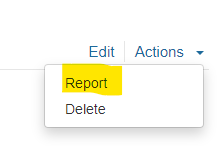
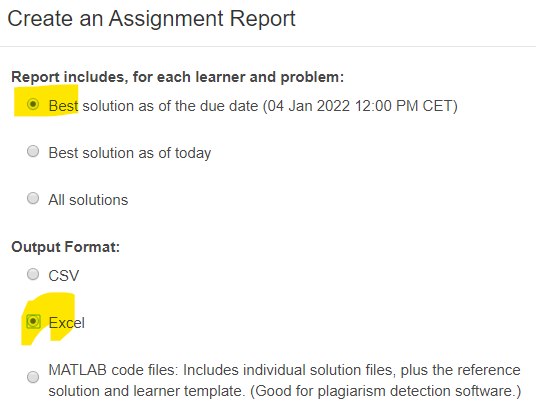

# How to use it

- Download Excel file from matlab grader. Check due date option. 

  -
  
  -
- Add this file to `files` folder next to `SCRIPT.m`
- Repeate for every Cviko
- Run `SCRIPT.m`
- It will produce a table
- More info in script itself
